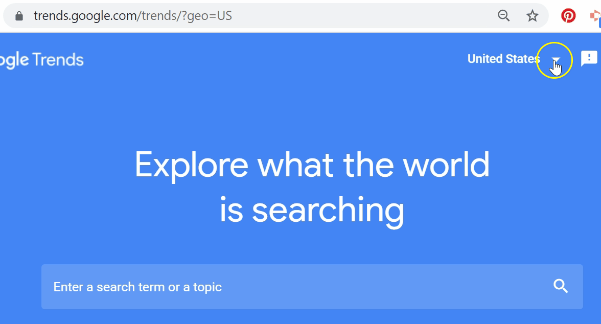

```{r setup, include=FALSE}
library(learnr)
library(tidyverse)
library(lubridate)
library(stringr)
library(glue)
library(rvest)

library(magick)
library(ggimage)
library(gtrendsR)
library(ggthemr)
ggthemr("fresh")
library(patchwork)

knitr::opts_chunk$set(echo = FALSE, 
                      message = FALSE, 
                      warning = FALSE)
tutorial_options(exercise.timelimit = 60)

# some functions
# using code/ideas from here https://www.hvitfeldt.me/blog/real-emojis-in-ggplot2/
emoji_image <- function(x) {
    paste0("https://emojipedia.org/", x) %>%
    read_html() %>%
    html_node('div[class="vendor-image"] img') %>%
    html_attr("src")
}


```

<link href="https://fonts.googleapis.com/css?family=Inconsolata|Londrina+Solid&display=swap" rel="stylesheet">

```{css}

.tutorialTitle:before {
  content: url("images/STATS100-Cover-Logo_small.png");
  display: block;
}

h1, h2, h3{
  font-family: 'Londrina Solid', cursive;
}

h3 {
  color: #f5af86;
}

h4 {
  font-family: 'Inconsolata', monospace;
  font-weight: bold;
}

.btn-primary {
  background-color: #f5af86;
}

.btn-primary:hover, .btn-primary:focus {
  background-color: #f5af86;
  opacity: 0.8;
}

.myButtonSelected {
  background-color:#666666;
}

.myButtonSelected:hover, .myButtonSelected:focus{
  background-color:#666666;
}

body, .btn{
  font-family: 'Inconsolata', monospace;
  font-size: 16px;
}

a {
  color: #000000;
  font-weight: bold;
  background-color: #F0F0F0;
}

a:hover, a:focus {
  color: #000000;
  opacity: 0.8;
}

blockquote {
  font-size: 16px;
  background-color: #f5af86;
  padding: 10px;
  color: #000000;
}
```

```{js echo=FALSE}
$(function() {
var editor;
$('.ace_editor').each(function( index ) {
  editor = ace.edit(this);
  editor.getSession().setUseWrapMode(true);
  editor.setFontSize("16px");
  });
})
```

## Introduction

These labs and investigations have been developed for STATS 100 Concepts in Statistics, an introductory statistics and data science course offered by the [Department of Statistics, University of Auckland](https://www.auckland.ac.nz/en/science/about-the-faculty/department-of-statistics.html). 

For more information, contact [Anna Fergusson](https://www.stat.auckland.ac.nz/people/amar112).

## Investigations {.tabset}

Here you will find some of the apps or tools Anna has developed for the investigations demonstrated in lectures.

### Google eats?

<br />

Is there an association between the price of food in NZ and people within NZ searching for food items on Google? Try out different food items in the app below and explore for yourself!

```{r, context="data"}
file_name <- "https://docs.google.com/spreadsheets/d/e/2PACX-1vQncFJgi1nqIMdn5zcaCxqv8QjQuAEmSWbzSXC80bkp6PwKoUDStY4rsYGao-MqC5Qgrsk9S4hWSsA_/pub?gid=0&single=true&output=csv"

df_food_prices <- read_csv(file_name) %>%
  mutate(date = ymd(case_when(
    str_sub(Period, start= -2) == ".1" ~ glue("{Period}0.1"),
    TRUE ~ glue("{Period}.1")))) %>%
  rename(value = Data_value, food = Series_title_1) %>%
  select(date, value, food) %>%
  mutate(date = floor_date(date, unit = "1 months" )) %>%
  group_by(date, food) %>%
  summarise(value = mean(value))

food_items <- df_food_prices %>%
  pull(food) %>%
  unique()
```

```{r, context="render"}
textInput("search_term", "Google search term", "tomato")
selectInput("food_name", "Food item", c("default"))
actionButton("update_data", "Update plots")
```

```{r, context="server"}
values <- reactiveValues(df_data = NULL,
                         min_date = NULL,
                         chart_title = NULL, 
                         chart_subtitle = NULL, 
                         chart_sources = NULL)

observeEvent(input$update_data, {
   showModal(modalDialog("Updating plots", footer=NULL))
    google_search_term <- input$search_term
    
    trend_data <- gtrends(keyword = c(google_search_term),
                          time = "all",
                          geo = c("NZ"))
    
    if (!is.null(trend_data$interest_over_time))
    {
    poss_food <- df_food_prices %>%
      filter(str_detect(str_to_lower(food), str_to_lower(google_search_term))) %>%
      pull(food) %>%
      unique()
    
    # check input box?
    nz_food_item <- input$food_name
    if (input$food_name == "default")
    {
      nz_food_item <- poss_food[1]
    }
    
    # check if food item selected is on poss_food
    if(!input$food_name %in% poss_food)
    {
      nz_food_item <- poss_food[1]
    }
  
    updateSelectInput(
      session,
      "food_name",
      choices = poss_food,
      selected = nz_food_item
    )
    
    # only select that food
    df_specific_food <- df_food_prices %>%
      filter(food == nz_food_item) %>%
      mutate(series = "mean_food_price")

    
  search_data <- trend_data$interest_over_time 
  missing_dates <- seq(ymd("2004-01-01"),
                       floor_date(Sys.Date(),
                                  "month"), 
                       by="months")

  if(length(missing_dates) > nrow(search_data))
  {
    missing_dates <- head(missing_dates, 
                          -(length(missing_dates) - nrow(search_data)))
  }

  search_data$date <- missing_dates
  
  gt_index <- search_data %>%
    select(date, hits) %>%
    rename(value = hits) %>%
    mutate(series = "google_search_interest")
  
  #min_date <- min(gt_index$date)
  min_date <- ymd("2015-01-01")
  
  combined_data <- bind_rows(gt_index, df_specific_food)
  food_data <- df_specific_food %>%
    filter(date >= min_date)
  
  combined_data$series <- factor(combined_data$series, 
                                 levels = c("mean_food_price",
                                            "google_search_interest"))
      
    values$min_date <- min_date
    values$df_data <- combined_data
    values$chart_title <- glue::glue("The mean price of '{nz_food_item}' in NZ \ncompared to Google search interest for '{google_search_term}' in NZ")
    values$chart_subtitle <- ""
    values$chart_sources <- "Data sources: StatsNZ and Google trends via {gtrendsR}"
    }
    removeModal()
  })

output$time_plot <- renderPlot({
  if (is.null(values$df_data)) return()
  values$df_data %>%
    filter(date >= values$min_date) %>%
    ggplot(aes(x = date, 
                  y = value, 
                  group = series, 
                  color = series)) +
    geom_point() +
    geom_line() +
    facet_wrap(~series, scale = "free_y", ncol = 1) +
    scale_x_date(date_breaks = "3 months",
                 date_labels = "%b\n%Y") +
    guides(color = FALSE)  +
    labs(title = values$chart_title,
         subtitle = values$chart_subtitle,
         caption = values$chart_sources,
         x = "Month")
})

output$corr_plot <- renderPlot({
  if (is.null(values$df_data)) return()
  values$df_data %>%
    select(date, series, value) %>%
    spread(series, value) %>%
    filter(date >= values$min_date,
           !is.na(mean_food_price)) -> combined_data_re
  
  search_correlation <- cor(combined_data_re$google_search_interest, 
      combined_data_re$mean_food_price, method = "spearman")
  
   p <- combined_data_re %>%
    ggplot() +
    geom_point(aes(google_search_interest, mean_food_price))  +
    scale_x_continuous(breaks = seq(0, 100, 10)) +
    annotate(geom = "label", 
             label = glue("Rank correlation coefficent: {round(search_correlation, 2)}"), 
             colour = "#666666",
             x = Inf, 
             y = Inf,
             vjust = 1,
             hjust = 1)  +
    labs(title = values$chart_title,
         subtitle = values$chart_subtitle,
         caption = values$chart_sources) 
  p + plot_spacer()
})
```

```{r, context="render"}
plotOutput("time_plot")
```

```{r, context="render"}
plotOutput("corr_plot")
```


## Lab info for students {data-progressive=FALSE}

### Need help with the labs?

As this is the first time we've offered these labs online, rather than in person, there might be aspects of the labs that are not as clear as they should be. We know that when you are working on these activities by yourself, it can be frustrating when you can't work out what to do! If you have any questions and you're on campus, you can always pop by Anna's office and ask her for help. Alternatively, you can write a question on Piazza and ask your fellow students for help :-) **Remember, we expect questions about the labs, so please please please ask them!**

{style="width:50%"}

### You want me to code?

Some of these labs will use programming languages like [R](https://www.theta.co.nz/news-blogs/tech-blog/what-is-r/). For this course, we will focus on learning how to adapt code to get what we want! We don't expect any students to know how to program or want to become programmers, but we hope you'll see that it's maybe something you could do and learn more about if you want to :-) **Knowing just a little bit about code and how other people use code is complementary to knowing how to use statistical methods to learn from data. Once you can start to think about what is possible to automate (get a computer to do), the more ideas you can develop for how to collect or generate data, or how to use algorithms to solve problems or make predictions.**

{style="width:50%"}

### How do we submit our work for each online lab?

Each lab task finishes with a challenge. For each challenge, you will be told what screenshots you need to include in your submission. For each submission, you'll also be asked to reflect on what you learned. Remember to use the online lab template (you can find this on CANVAS) and to download/save the document as PDF before submitting through CANVAS.

## Lab 1

### Creating informative time series plots

In this lab, you will learn how to make informative time series plots using the [programming language R](https://www.theta.co.nz/news-blogs/tech-blog/what-is-r/) and [Google Trends](https://trends.google.com/trends/) data.

> The recommended start date for this lab is **Week 3**, as you'll use statistical and computational ideas covered in Topic 1A (Week 1).

### Google eats?

Watch this short video about how you can use Google to find recipes for different foods!


### How do Google search trends compare between different countries?

We can use data from [Google Trends](https://trends.google.com/trends/) to explore when people googled for different food items. 

Below is a plot embedded from Google Trends, showing search interest **within NZ** for tomatoes across the last five years. It's interactive, so you can move your mouse/cursor over the graph and read information about each data point.

<script type="text/javascript" src="https://ssl.gstatic.com/trends_nrtr/2051_RC11/embed_loader.js"></script> <script type="text/javascript"> trends.embed.renderExploreWidget("TIMESERIES", {"comparisonItem":[{"keyword":"tomato","geo":"NZ","time":"today 5-y"}],"category":0,"property":""}, {"exploreQuery":"date=today%205-y&geo=US&q=tomato","guestPath":"https://trends.google.com:443/trends/embed/"}); </script> 

<br />

And here is another plot, showing search interest **within the US** for tomatoes across the last five years.

<script type="text/javascript" src="https://ssl.gstatic.com/trends_nrtr/2051_RC11/embed_loader.js"></script> <script type="text/javascript"> trends.embed.renderExploreWidget("TIMESERIES", {"comparisonItem":[{"keyword":"tomato","geo":"US","time":"today 5-y"}],"category":0,"property":""}, {"exploreQuery":"date=today%205-y&geo=US&q=tomato","guestPath":"https://trends.google.com:443/trends/embed/"}); </script> 

<br />

Both of these plots show seasonality (a repeating pattern, in this case one that repeats every 12 months), but search interest for tomatoes in NZ peaks around the start of each year (our summer) whereas search interest for tomatoes in US peaks around the middle of each year (their summer).

### Can we recreate and combine these plots with code?

We can get the Google Trends data about different search words using a R package called `{gtrendsR}`. A package is a collection of R code functions that someone else has written that we can use to do awesome things!

> Run the code below. Then change the geo (country) from "NZ" to "US", and run the code again. **Check each plot produced looks similar to the ones embedded above (scroll up to compare).**

```{r lab1plot, exercise = TRUE}
data <- gtrends(keyword = "tomato",
                geo = "NZ")

trend_data <- data$interest_over_time %>%
  mutate(date = as.Date(date),
         hits = as.numeric(hits))
  
trend_data %>%
  ggplot(aes(x = date, 
             y = hits)) +
  geom_line() +
  labs(x = "Date (weekly)",
       y = "Search interest")
```

### NZ vs US

We can combine Google Trends data from two different countries by slightly changing the code. For the code I just gave you, the lines of code that determined which country to get data from were these ones:

```{r one_country, echo=TRUE}
data <- gtrends(keyword = "tomato",
                geo = "NZ")
```

So we can get and compare data from NZ and the US, the code changes to this:

```{r two_countries, echo=TRUE}
data <- gtrends(keyword = "tomato",
                geo = c("NZ", "US"))
```

So `"NZ"` has changed to `c("NZ", "US")`, which is how we tell `R` to look at a "list" of things, rather than just one thing. We do this by putting a `c()` around the list, and separating items in the list with a `,`. We've used `"` around the words because they are words, not numbers. 

> Try running the code below to see how the NZ and US search interest for tomato compare on the same plot!

```{r lab1compare, exercise = TRUE}
data <- gtrends(keyword = "tomato",
                geo = c("NZ", "US"))

trend_data <- data$interest_over_time %>%
  mutate(date = as.Date(date),
         hits = as.numeric(hits))
  
trend_data %>%
  ggplot(aes(x = date, 
             y = hits,
             group = geo,
             colour = geo)) +
  geom_line() +
  labs(x = "Date (weekly)",
       y = "Search interest")
```

Now we can compare the seasonality better, and also learn that for some reason, New Zealanders search for tomatoes at relatively higher rates than those from the US. 

### Just a little bit about URL hacking

What if we want to get the search interest for tomatoes for other countries? What are their codes?

You can figure this out by paying attention to the URL (the web address) and noticing what changes in the URL when you change the country in [Google Trends](https://trends.google.com/trends/?geo=US).

{style="width:100%"}

You can also find a searchable list of all the two-letter country codes on the [ISO website](https://www.iso.org/obp/ui/#search).

> Adjust the code below to compare search interest for tomatoes between NZ and another country (not the US) and then run the code.

```{r lab1C, exercise = TRUE}
data <- gtrends(keyword = "tomato",
                geo = c("NZ", "US"))

trend_data <- data$interest_over_time %>%
  mutate(date = as.Date(date),
         hits = as.numeric(hits))
  
trend_data %>%
  ggplot(aes(x = date, 
             y = hits,
             group = geo,
             colour = geo)) +
  geom_line() +
  labs(x = "Date (weekly)",
       y = "Search interest")
```

### Mini-challenge time {.tabset}

Can you work out how to change the code below so you compare the search interest for `avocado` between Mexico, Japan and Spain?

#### Try it out!

```{r lab1D, exercise = TRUE}
data <- gtrends(keyword = "tomato",
                geo = c("NZ", "US"))

trend_data <- data$interest_over_time %>%
  mutate(date = as.Date(date),
         hits = as.numeric(hits))
  
trend_data %>%
  ggplot(aes(x = date, 
             y = hits,
             group = geo,
             colour = geo)) +
  geom_line() +
  labs(x = "Date (weekly)",
       y = "Search interest")
```

> How do the search trends compare? Which country has relatively higher rates of search interest for avocados?

#### See an answer

```{r threeway, echo=TRUE}
data <- gtrends(keyword = "avocado",
                geo = c("MX", "JP", "ES"))

trend_data <- data$interest_over_time %>%
  mutate(date = as.Date(date),
         hits = as.numeric(hits))
  
trend_data %>%
  ggplot(aes(x = date, 
             y = hits,
             group = geo,
             colour = geo)) +
  geom_line() +
  labs(x = "Date (weekly)",
       y = "Search interest")
```

### Optional extra

In tutorial 1A, you also saw plots where each group/series being compared had its own plot. We call this "subsetting" or "facetting". The code below shows how to do this using by adding `facet_wrap(~geo)`, and the resulting graphic!

> Note, for this version we have kept the axis and scale the same for all the countries being compared, since the variable being used is a relative measure.

```{r facetting, echo=TRUE}
data <- gtrends(keyword = "avocado",
                geo = c("NZ", "US", "AU"))

trend_data <- data$interest_over_time %>%
  mutate(date = as.Date(date),
         hits = as.numeric(hits))
  
trend_data %>%
  ggplot(aes(x = date, 
             y = hits,
             group = geo,
             colour = geo)) +
  geom_line() +
  labs(x = "Date (weekly)",
       y = "Search interest") +
  facet_wrap(~geo)
```

### It's a plot but not that informative!

One of the things that can help make a plot more informative is to provide good labels for the axes, a descriptive title and helpful subtitle, and to include a caption that explains where the data came from. We can add this information to our plot by using the `labs()` function. 

> Run the code below and read the new labels that have been added to the plot. Then try changing words within the code below to change the labels that get printed on the plot.

```{r lab1informative, exercise = TRUE, exercise.lines = 16}
data <- gtrends(keyword = "egg",
                geo = "NZ")

trend_data <- data$interest_over_time %>%
  mutate(date = as.Date(date),
         hits = as.numeric(hits))
  
trend_data %>%
  ggplot(aes(x = date, 
             y = hits)) +
  geom_line() +
  labs(title = "Describe the plot here",
       subtitle = "Give the date range here",
       x = "Write the x-axis label here",
       y = "Write the y-axis label here",
       caption = "Source: Write where the data came from")
```

### A question of time ...

We can also adjust the scales used (the numbers along the x and y axes) so that we can more easily read off values. 

Since this is weekly data for the last five years, it would be nice to see where each year starts. In the code below `date_breaks = "12 months"` has been used to get the numbers of the axes to be spaced apart by 12 months.

Remember, search interest is a relative measure and is always a number between 0 and 100. We can change the scale using the code `breaks = seq(0, 100, 20)`. This says 'Use numbers between 0 and 100 and space them 20 apart'.

> Run the code below to see how these extra lines of code change the format of the plot. Then try changing the date breaks to be 24 months, and the numbers of the y-axis to be spaced 40 apart rather than 20. **NB: Neither of these suggestions are good ones in terms of making your plot more informative!**


```{r lab1scales, exercise = TRUE, exercise.lines=16}
data <- gtrends(keyword = "avocado",
                geo = c("NZ"))

trend_data <- data$interest_over_time %>%
  mutate(date = as.Date(date),
         hits = as.numeric(hits))
  
trend_data %>%
  ggplot(aes(x = date, 
             y = hits)) +
  geom_line() +
  labs(x = "Date (weekly)",
       y = "Search interest") +
  scale_x_date(date_breaks = "12 months",
               date_labels = "%b\n%Y") +
  scale_y_continuous(breaks = seq(0, 100, 20))
```

### Colour my world!

We will just cover a little bit about colour in this lab, and mostly let the theme we're using for out plots to allocate colours for us. One of the ways we can define a colour is by using a hex code. A hex code starts with a `#` and is followed by a combination of six letters or numbers e.g. `#d3d3d3`. There's lots of tools online to help you choose colours and get their hex codes - [try this one out](https://www.w3schools.com/colors/colors_picker.asp){target='blank'}. 

> Run the code below. Then find a background colour you like, and then change the hex code below to change the background colour of the plot. I've chosen a lemon colour below to match the keyword lemon!

```{r lab1colour, exercise = TRUE}
data <- gtrends(keyword = "lemon",
                geo = "NZ")

trend_data <- data$interest_over_time %>%
  mutate(date = as.Date(date),
         hits = as.numeric(hits))
  
trend_data %>%
  ggplot(aes(x = date, 
             y = hits)) +
  geom_line() +
  labs(x = "Date (weekly)",
       y = "Search interest") +
  theme(panel.background = element_rect(fill = "#ffff99"))
```


### Just for fun! {.tabset}

We can also play around with what we use as the points on the plot.

> Run the code under each tab. Can you work out what was added to the `boring points` code to add points? Then try changing the `fun emojis` code to show search interest for kiwifruit using kiwifruit emoji!

#### Adding boring points

```{r lab1boring, exercise = TRUE}
data <- gtrends(keyword = "egg",
                geo = "NZ")

trend_data <- data$interest_over_time %>%
  mutate(date = as.Date(date),
         hits = as.numeric(hits))
  
trend_data %>%
  ggplot(aes(x = date, 
             y = hits)) +
  geom_line() +
  geom_point() +
  labs(x = "Date (weekly)",
       y = "Search interest")
```

#### Adding fun emojis

```{r lab1fun, exercise = TRUE, exercise.lines=16}
emoji <- emoji_image("egg")

data <- gtrends(keyword = "egg",
                geo = "NZ")

trend_data <- data$interest_over_time %>%
  mutate(date = as.Date(date),
         hits = as.numeric(hits))
  
trend_data %>%
  ggplot(aes(x = date, 
             y = hits)) +
  geom_line() +
  geom_image(aes(image = emoji), size = 0.05) +
  labs(x = "Date (weekly)",
       y = "Search interest")
```

### Lab challenge!

Your challenge is to create your own informative time series plot. For your plot, you need to:

 + Use a keyword that is different from any of the examples used in the lab
 + Compare search interest for two or more countries different from the examples used in the lab (i.e. not NZ or US)
 + Create a plot that has informative labels
 + Change the scales so that they are more helpful and clearer for reading values
 + Change the background colour from white to another colour
 
**You can do more than this if you want to, but you don't have to!**

The code below will get you started on making an informative plot, but you will need to adjust it. <mark>Remember, you can scroll back up the page to see examples of how to make the changes!</mark>

> You will need to take screenshots of **the code you used** and **the plot produced** and include these in your submission for this lab.

```{r lab1challenge, exercise = TRUE, exercise.lines = 25}
data <- gtrends(keyword = "tomato",
                geo = c("NZ", "US"))

trend_data <- data$interest_over_time %>%
  mutate(date = as.Date(date),
         hits = as.numeric(hits))
  
trend_data %>%
  ggplot(aes(x = date, 
             y = hits,
             group = geo,
             colour = geo)) +
  geom_line() +
  labs(title = "YouTube searches for TikTok",
       subtitle = "Daily search interest (1999 - 2001)",
       x = "Write the x-axis label here",
       y = "Search interest",
       caption = "Source: Write where the data came from") +
  scale_x_date(date_breaks = "24 months",
               date_labels = "%b\n%Y") +
  scale_y_continuous(breaks = seq(0, 100, 1)) +
  theme(panel.background = element_rect(fill = "#ffff99"))
```
