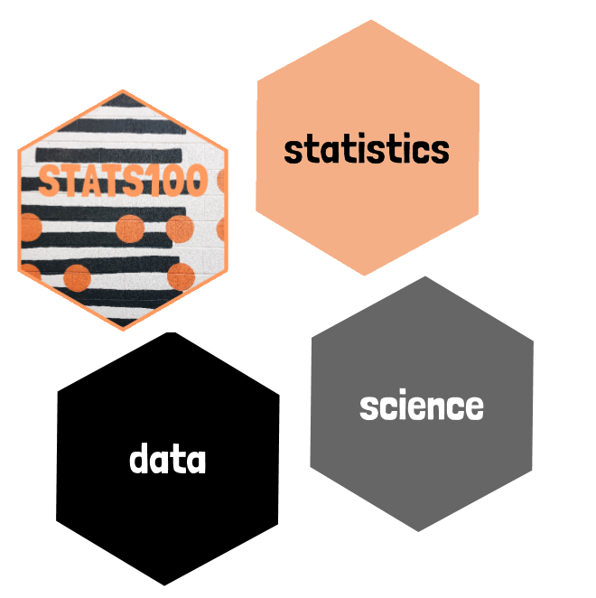

```{r setup, include=FALSE}
library(shiny)
library(tidyverse)
library(lubridate)
library(glue)
library(gtrendsR)
library(stringr)
library(ggthemr)
ggthemr("fresh")
library(patchwork)

knitr::opts_chunk$set(echo = FALSE, message = FALSE, warning = FALSE)
```

<link href="https://fonts.googleapis.com/css?family=Inconsolata|Londrina+Solid&display=swap" rel="stylesheet">

```{css}
h1, h3{
  font-family: 'Londrina Solid', cursive;
}

h3 {
  color: #f5af86;
}

body{
  font-family: 'Inconsolata', monospace;
}

a {
  color: #000000;
  font-weight: bold;
  text-decoration: underline;
}
```

# {.tabset}

## Introduction

{style="width:300px"}

These investigations have been developed for STATS 100 Concepts in Statistics, an introductory statistics and data science course offered by the [Department of Statistics, University of Auckland](https://www.auckland.ac.nz/en/science/about-the-faculty/department-of-statistics.html). 

For more information, contact [Anna Fergusson](https://www.stat.auckland.ac.nz/people/amar112).


## 1A Google eats?

```{r, context="data"}
file_name <- "https://docs.google.com/spreadsheets/d/e/2PACX-1vQncFJgi1nqIMdn5zcaCxqv8QjQuAEmSWbzSXC80bkp6PwKoUDStY4rsYGao-MqC5Qgrsk9S4hWSsA_/pub?gid=0&single=true&output=csv"

df_food_prices <- read_csv(file_name) %>%
  mutate(date = ymd(glue("{Period}.1"))) %>%
  rename(value = Data_value, food = Series_title_1) %>%
  select(date, value, food) %>%
  mutate(date = floor_date(date, unit = "1 months" )) %>%
  group_by(date, food) %>%
  summarise(value = mean(value))

food_items <- df_food_prices %>%
  pull(food) %>%
  unique()
```

```{r, context="render"}
textInput("search_term", "Google search term", "tomato")
selectInput("food_name", "Food item", c("default"))
actionButton("update_data", "Update plots")
```

```{r, context="server"}
values <- reactiveValues(df_data = NULL,
                         min_date = NULL,
                         chart_title = NULL, 
                         chart_subtitle = NULL, 
                         chart_sources = NULL)

observeEvent(input$update_data, {
   showModal(modalDialog("Updating plots", footer=NULL))
    google_search_term <- input$search_term
    
    trend_data <- gtrends(keyword = c(google_search_term),
                          time = "all",
                          geo = c("NZ"))
    
    if (!is.null(trend_data$interest_over_time))
    {
    poss_food <- df_food_prices %>%
      filter(str_detect(str_to_lower(food), str_to_lower(google_search_term))) %>%
      pull(food) %>%
      unique()
    
    # check input box?
    nz_food_item <- input$food_name
    if (input$food_name == "default")
    {
      nz_food_item <- poss_food[1]
    }
    
    # check if food item selected is on poss_food
    if(!input$food_name %in% poss_food)
    {
      nz_food_item <- poss_food[1]
    }
  
    updateSelectInput(
      session,
      "food_name",
      choices = poss_food,
      selected = nz_food_item
    )
    
    # only select that food
    df_specific_food <- df_food_prices %>%
      filter(food == nz_food_item) %>%
      mutate(series = "mean_food_price")

    
  search_data <- trend_data$interest_over_time 
  missing_dates <- seq(ymd("2004-01-01"),
                       floor_date(Sys.Date(),
                                  "month"), 
                       by="months")

  if(length(missing_dates) > nrow(search_data))
  {
    missing_dates <- head(missing_dates, 
                          -(length(missing_dates) - nrow(search_data)))
  }

  search_data$date <- missing_dates
  
  gt_index <- search_data %>%
    select(date, hits) %>%
    rename(value = hits) %>%
    mutate(series = "google_search_interest")
  
  #min_date <- min(gt_index$date)
  min_date <- ymd("2015-01-01")
  
  combined_data <- bind_rows(gt_index, df_specific_food)
  food_data <- df_specific_food %>%
    filter(date >= min_date)
  
  combined_data$series <- factor(combined_data$series, 
                                 levels = c("mean_food_price",
                                            "google_search_interest"))
      
    values$min_date <- min_date
    values$df_data <- combined_data
    values$chart_title <- glue::glue("The mean price of '{nz_food_item}' in NZ \ncompared to Google search interest for '{google_search_term}' in NZ")
    values$chart_subtitle <- ""
    values$chart_sources <- "Data sources: StatsNZ and Google trends via {gtrendsR}"
    }
    removeModal()
  })

output$time_plot <- renderPlot({
  if (is.null(values$df_data)) return()
  values$df_data %>%
    filter(date >= values$min_date) %>%
    ggplot(aes(x = date, 
                  y = value, 
                  group = series, 
                  color = series)) +
    geom_point() +
    geom_line() +
    facet_wrap(~series, scale = "free_y", ncol = 1) +
    scale_x_date(date_breaks = "3 months",
                 date_labels = "%b\n%Y") +
    guides(color = FALSE)  +
    labs(title = values$chart_title,
         subtitle = values$chart_subtitle,
         caption = values$chart_sources,
         x = "Month")
})

output$corr_plot <- renderPlot({
  if (is.null(values$df_data)) return()
  values$df_data %>%
    select(date, series, value) %>%
    spread(series, value) %>%
    filter(date >= values$min_date,
           !is.na(mean_food_price)) -> combined_data_re
  
  search_correlation <- cor(combined_data_re$google_search_interest, 
      combined_data_re$mean_food_price, method = "spearman")
  
   p <- combined_data_re %>%
    ggplot() +
    geom_point(aes(google_search_interest, mean_food_price))  +
    scale_x_continuous(breaks = seq(0, 100, 10)) +
    annotate(geom = "label", 
             label = glue("Rank correlation coefficent: {round(search_correlation, 2)}"), 
             colour = "#666666",
             x = Inf, 
             y = Inf,
             vjust = 1,
             hjust = 1)  +
    labs(title = values$chart_title,
         subtitle = values$chart_subtitle,
         caption = values$chart_sources) 
  p + plot_spacer()
})
```

```{r, context="render"}
plotOutput("time_plot")
```

```{r, context="render"}
plotOutput("corr_plot")
```