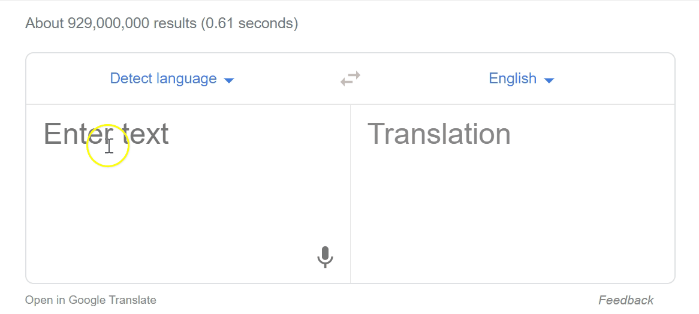

```{r setup, include=FALSE}
library(learnr)
library(tidyverse)
library(stringr)
library(glue)
library(jsonlite)
library(knitr)

knitr::opts_chunk$set(echo = FALSE, 
                      message = FALSE, 
                      warning = FALSE)
tutorial_options(exercise.timelimit = 60)

# I think the stuff below means the previous code is not cached but ???
options(tutorial.storage = list(
  # save an arbitrary R object "data" to storage
   save_object = function(tutorial_id, tutorial_version, user_id, object_id, data) {},
  # retreive a single R object from storage
  get_object = function(tutorial_id, tutorial_version, user_id, object_id) { 
    NULL 
  },
  
  # retreive a list of all R objects stored
  get_objects = function(tutorial_id, tutorial_version, user_id) { 
    list() 
  },
  
  # remove all stored R objects
  remove_all_objects = function(tutorial_id, tutorial_version, user_id) {
  }
))

# some functions

googleTranslate <- function(fromText, fromLanguage, toLanguage){
  fromText <- paste(fromText, collapse="|")
  url <- URLencode(glue("https://script.google.com/macros/s/AKfycbx3Bl6TUgxuG3YlqwEuWdADn9TeB05TpP0mzPRYzT1GKmBTZVk/exec?q={fromText}&source={fromLanguage}&target={toLanguage}"))
  fromJSON(url)
}
```


```{css}

@import url('https://fonts.googleapis.com/css?family=Inconsolata|Londrina+Solid&display=swap');

.tutorialTitle:before {
  content: url("images/STATS100-Cover-Logo_small.png");
  display: block;
}

h1, h2, h3{
  font-family: 'Londrina Solid', cursive;
}

h3 {
  color: #f5af86;
}

h4 {
  font-family: 'Inconsolata', monospace;
  font-weight: bold;
}

.btn-primary {
  background-color: #f5af86;
}

.btn-primary:hover, .btn-primary:focus {
  background-color: #f5af86;
  opacity: 0.8;
}

.myButtonSelected {
  background-color:#666666;
}

.myButtonSelected:hover, .myButtonSelected:focus{
  background-color:#666666;
}

body, .btn{
  font-family: 'Inconsolata', monospace;
  font-size: 16px;
}

a {
  color: #000000;
  font-weight: bold;
  background-color: #F0F0F0;
}

a:hover, a:focus {
  color: #000000;
  opacity: 0.8;
}

blockquote {
  font-size: 16px;
  background-color: #f5af86;
  padding: 10px;
  color: #000000;
}

.highlight {
  background-color: #F0F0F0;
}

td {
  padding: 10px;
}

tr {
  border: solid #ddd 1px;
}

.center-align{ text-align:center;}
```

```{js echo=FALSE}
$(function() {
var editor;
$('.ace_editor').each(function( index ) {
  editor = ace.edit(this);
  editor.getSession().setUseWrapMode(true);
  editor.setFontSize("16px");
  });
  
    $( ".twotwo > table" ).each(function( index ) {
  var tb_rows = $(this).find('> tbody > tr');
  for(var i = 0; i < tb_rows.length; i++)
  {
    var tb_cols = $(tb_rows[i]).find('td');
    for(var j = 1; j < tb_cols.length; j++)
    {
        var checkText = $(tb_cols[j]).html().trim();
        $(tb_cols[j]).data( "answer", checkText );
        $(tb_cols[j]).html("");
        $(tb_cols[j]).attr('contenteditable','true');
        $(tb_cols[j]).addClass("anscheck");
        $(tb_cols[j]).addClass("center-align");
    }
  }
  });
  
    $( ".twotwocomplete > table" ).each(function( index ) {
  var tb_rows = $(this).find('> tbody > tr');
  for(var i = 0; i < tb_rows.length; i++)
  {
    var tb_cols = $(tb_rows[i]).find('td');
    for(var j = 1; j < tb_cols.length; j++)
    {
        $(tb_cols[j]).attr('contenteditable','true');
        $(tb_cols[j]).addClass("center-align");
    }
  }
  });
  
  $(".anscheck").keyup(function(){
  var ans = $(this).html();
  var correct = $(this).data("answer");
  if(ans == correct){
     $(this).css("background-color", "#c1dba9");
  }
  else
  {
    $(this).css("background-color", "#dbaea9");
  }
});

  $(".topic").click(function(){
    if($(this).text() == "Return to home page"){
    window.location.href = "https://stats100.docker.stat.auckland.ac.nz/";
    }
  })

})
```

## Lab 2

### Investigating data and model bias

In this lab, you will explore how gender bias can be an issue within an area of data science called NLP (natural language processing).

> The recommended start date for this lab is **Week 4**, as you'll use statistical and computational ideas covered in Topics 1B & 1C (Weeks 2 & 3).

### Now this is a story ...

Watch this short video that demonstrates what can happen when you translate sentences from English to another language and then back again to English using Google Translate!


### Let's translate some of those lyrics ourselves!

The first "sentence" of the lyrics from the Fresh Price of Bel Air are:

<span class='highlight'>Now, this is a story all about how my life got flipped-turned upside down</span>

You can access <a href="https://www.google.com/search?q=google+translate&oq=google+translate" target="_blank">Google Translate here</a>. 

> Try translating this first verse in and out of **different languages of your choice** using Google Translate. How similar is the English version when you reverse translate?

{style="width:100%"}

### Same process, but using code

We can use code to do the same thing.

Anna has written a function called `googleTranslate` that we can use in R to access the Google Translate API and carry out the *English -> Other language -> English* translation process. 

The `googleTranslate` function takes three arguments: 

- `fromText`, the phrase you want to translate
- `fromLanguageCode`, the code for the language the phrase is written in
- `toLanguageCode`, the code for the language you want to translate the phrase into

> Try running the code below to see what happens if we tranlsate the same verse into Te Reo and back again!

```{r lab2gt, exercise=TRUE, exercise.lines = 7}
lyrics <- "Now, this is a story all about how my life got flipped-turned upside down"

googleTranslate(fromText = lyrics, 
                fromLanguage = "EN", 
                toLanguage = "MI") %>%
  pivot_longer(everything()) %>%
  kable(col.names = NULL)
```

### Mini-challenge time {.tabset}

Can you work out how to change the code below to translate the phrase "She is a data scientist" into and back from Finnish?

You can find <a href="https://cloud.google.com/translate/docs/languages" target="_blank">the different language codes here</a>.

#### Try it out!

```{r lab2try, exercise=TRUE, exercise.lines = 7}
text <- "Put the text you want to translate here"

googleTranslate(fromText = text, 
                fromLanguage = "EN", 
                toLanguage = "MI") %>%
  pivot_longer(everything()) %>%
  kable(col.names = NULL)
```

#### See an answer!

```{r lab2mini, echo = TRUE}
text <- "She is a data scientist"

googleTranslate(fromText = text, 
                fromLanguage = "EN", 
                toLanguage = "FI") %>%
  pivot_longer(everything()) %>%
  kable(col.names = NULL)
```

### Wait, what?

"She is a data scientist" became "He is a factor" when translated to and from Finnish. What went wrong with that reverse translation?

The occupation "data scientist" is a new-ish job title, and perhaps not one used a lot in Finland, which could explain the translation issue. But another important difference is that the "She" because a "He". Is this an issue, or just a one off weird event?

> Run the code below, and then try some other gendered job descriptions like "She is an engineer" or "He is a dancer" or "She is a pilot" or "He is a cleaner".

```{r lab2gender, exercise=TRUE}
text <- "She is an accountant"

googleTranslate(fromText = text, 
                fromLanguage = "EN", 
                toLanguage = "FI") %>%
  pivot_longer(everything()) %>%
  kable(col.names = NULL)
```

### Still need convincing? 

The code below takes 10 gendered descriptions of occuptions - five male and five female - and translates each of them to and back from **Turkish**.

> Run the code below to see the results

```{r lab2automate, exercise=TRUE}
text <- c("She is an accountant",
          "He is a cleaner",
          "She is an engineer",
          "He is a nanny",
          "She is a doctor",
          "He is a teacher",
          "She is an architect",
          "He is a nurse",
          "She is a builder",
          "He is a teller")

googleTranslate(fromText = text, 
                fromLanguage = "EN", 
                toLanguage = "TR")
```

### Checking model "correctness" with a two-way table

When we compare the gender of the original phrases to their reverse translated versions, four stay the same and six change! 

> Complete the interactive two-way table of counts below to confirm that there are four "correct" translations (the diagonal of the two-way table of counts) - scroll back up to the results to help you do this!

#### {.twotwo}

|  | Translated he| Translated she | TOTAL |
| - | - | - | - |
| Original he | 3 | 2 | 5 |
| Original she |  4| 1 | 5 |
| TOTAL | 7 | 3 | 10 |

### Why the gender bias?

The article that inspired this lab can be found here: <a href="https://qz.com/1141122/google-translates-gender-bias-pairs-he-with-hardworking-and-she-with-lazy-and-other-examples/ " target="_blank">Google Translate's gender bias pairs 'he' with hardworking and 'she' with lazy, and other examples</a>

> It's worth taking a quick read of the article (it's not very long). 

Google Translate is an example of machine learning, specifically a neural network, being used to process language. In the Finnish and Turkish languages, there are not specific pronouns for gender, just one that is used for everyone (similar to using "they" instead of "he" or "she").

So how does the algorithm/model decide what gender to use then when we reverse translate back to English? The Google Translate model has been trained on lots and lots of real written examples from the different languages.

For example, we know there are fewer female engineers compared to male engineers. This could mean female engineers are not written about as much as male engineers. The Google Translate model gets trained on written language that doesn't refer to female engineers very often, so ends up learning that engineers are likely to be male. While this does reflect the current reality, this is still a bias for automation because not all engineers are male.

### Lab challenge!

Your challenge is to investigate whether there is gender bias for descriptions of animals.

 + Use a langugage that does not have separate pronouns for "he" or "she" (e.g. Turkish, Finnish, Estonian, or another language)
 + Compare gendered descriptions of 10 different animals (e.g. He is a shark)
 + Create a two-way table of counts of the results

The code below will get you started but you will need to adjust it. <mark>Remember, you can scroll back up the page to see examples of how to make the changes!</mark>

> You will need to take screenshots of **the code you used**, **the results produced**, and **the two-way table of counts** and include these in your submission for this lab.

```{r lab2challenge, exercise = TRUE, exercise.lines = 15}
text <- c("She is an accountant",
          "He is a cleaner",
          "She is an engineer",
          "He is a nanny",
          "She is a doctor")

googleTranslate(fromText = text, 
                fromLanguage = "EN", 
                toLanguage = "IT")
```

#### {.twotwocomplete}

|  | Translated he| Translated she | TOTAL |
| - | - | - | - |
| Original he |  |  |  |
| Original she |  |  |  |
| TOTAL |  |  |  10 |

## Return to home page