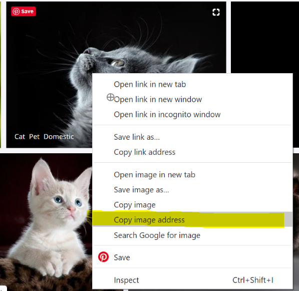

```{r setup, include=FALSE}
library(learnr)
library(tidyverse)
library(stringr)
library(glue)
library(rvest)
library(magick)
library(jsonlite)
library(knitr)
library(httr)

knitr::opts_chunk$set(echo = FALSE, 
                      message = FALSE, 
                      warning = FALSE)
tutorial_options(exercise.timelimit = 60)

# I think the stuff below means the previous code is not cached but ???
options(tutorial.storage = list(
  # save an arbitrary R object "data" to storage
   save_object = function(tutorial_id, tutorial_version, user_id, object_id, data) {},
  # retreive a single R object from storage
  get_object = function(tutorial_id, tutorial_version, user_id, object_id) { 
    NULL 
  },
  
  # retreive a list of all R objects stored
  get_objects = function(tutorial_id, tutorial_version, user_id) { 
    list() 
  },
  
  # remove all stored R objects
  remove_all_objects = function(tutorial_id, tutorial_version, user_id) {
  }
))

# some functions

# using code/ideas from here https://www.hvitfeldt.me/blog/real-emojis-in-ggplot2/
emoji_image <- function(x) {
  
  x <- x %>% str_replace_all(" ","-")
  r <- paste0("https://emojipedia.org/", x) %>% 
    GET()
  if(status_code(r) == 200)
  {
  res <- paste0("https://emojipedia.org/", x) %>%
    read_html() %>%
    html_node('body > div.container > div.content > article > section.vendor-list > ul > li:nth-child(2) > div.vendor-container.vendor-rollout-target > div.vendor-image > img') %>%
    html_attr("src")
    return(res)
  }
  else
  {
      # confused-face for not found
    return("https://emojipedia-us.s3.dualstack.us-west-1.amazonaws.com/thumbs/240/google/241/confused-face_1f615.png")
  }
}

googleTranslate <- function(fromText, fromLanguage, toLanguage){
  fromText <- paste(fromText, collapse="|")
  url <- URLencode(glue("https://script.google.com/macros/s/AKfycbx3Bl6TUgxuG3YlqwEuWdADn9TeB05TpP0mzPRYzT1GKmBTZVk/exec?q={fromText}&source={fromLanguage}&target={toLanguage}"))
  fromJSON(url) %>% pull(translated_phrase) %>% asis_output()
}

```


```{css}

@import url('https://fonts.googleapis.com/css?family=Inconsolata|Londrina+Solid&display=swap');

.tutorialTitle:before {
  content: url("images/STATS100-Cover-Logo_small.png");
  display: block;
}

h1, h2, h3{
  font-family: 'Londrina Solid', cursive;
}

h3 {
  color: #f5af86;
}

h4 {
  font-family: 'Inconsolata', monospace;
  font-weight: bold;
}

.btn-primary {
  background-color: #f5af86;
}

.btn-primary:hover, .btn-primary:focus {
  background-color: #f5af86;
  opacity: 0.8;
}

.myButtonSelected {
  background-color:#666666;
}

.myButtonSelected:hover, .myButtonSelected:focus{
  background-color:#666666;
}

body, .btn{
  font-family: 'Inconsolata', monospace;
  font-size: 16px;
}

a {
  color: #000000;
  font-weight: bold;
  background-color: #F0F0F0;
}

a:hover, a:focus {
  color: #000000;
  opacity: 0.8;
}

blockquote {
  font-size: 16px;
  background-color: #f5af86;
  padding: 10px;
  color: #000000;
}

.highlight {
  background-color: #F0F0F0;
}

td {
  padding: 10px;
}

tr {
  border: solid #ddd 1px;
}

.center-align{ text-align:center;}
```

```{js echo=FALSE}
$(function() {
  var editor;
  $('.ace_editor').each(function( index ) {
    editor = ace.edit(this);
    editor.getSession().setUseWrapMode(true);
    editor.setFontSize("16px");
    });


  $(".topic").click(function(){
    if($(this).text() == "Return to home page"){
    window.location.href = "https://stats100.docker.stat.auckland.ac.nz/";
    }
  })
  
})
```

## Lab 3

### Generating data from models

In this lab, you will learn how to create fun graphics and memes using chance models.

> The recommended start date for this lab is **Week 6**, as you'll use statistical and computational ideas covered in Topics 2A and 2B (Weeks 4 and 5). **Additionally, you should have completed Lab 1 & Lab 2 before attempting this lab :-)**

### A fun example of a chance model

Chance models are not just used for carrying out statistical tests, but also for making fun interactive things too!

Watch the short extract of the video below:

<iframe width="560" height="315" src="https://www.youtube.com/embed/LuoW-qV5oPQ?start=1&end=38" frameborder="0" allow="accelerometer; autoplay; encrypted-media; gyroscope; picture-in-picture" allowfullscreen></iframe>

<br />And then this next short extract that explains how the "maths" works:

<iframe width="560" height="315" src="https://www.youtube.com/embed/LuoW-qV5oPQ?start=936&end=987" frameborder="0" allow="accelerometer; autoplay; encrypted-media; gyroscope; picture-in-picture" allowfullscreen></iframe>

### Let's create something like this interactive poster with code!

We are going to use just a few of the functions from the [`magick`](https://cran.r-project.org/web/packages/magick/vignettes/intro.html) package for this lab. 

Unlike other labs, we are going to build up the code from scratch so you can learn a little more about how we can write code to create cool things.

> Key learning ideas about code will be highlighted like this! These are ideas we have already used in labs 1 and 2, and will continue to use for the remaining labs. 

### Let's make a box for the poster!

The first thing we need is to display a square box, like the one shown in the video:


To do that, we use the function `image_blank()` to create a new blank image that has a grey background. Run the code below to create the poster background!

```{r make-box, exercise=TRUE}
image_blank(width = 500, 
            height = 500, 
            color = "#999999")
```

> Any of the functions in this lab that start with `image_` e.g. `image_blank()` come from the magick package. A package is a collection of helpful functions that someone else has written that we can use to make cool stuff.

### Time to get argumentative!

We will use a lot of functions in our code. Functions look like this: `image_blank()`


You'll see in the previous that we had to define the width and height of the image (in pixels), as well as the hex code for the colour. These are called the **arguments** of the function. 

> Each argument is given a value using an `=` sign. We separate each argument with a `,` so the computer knows they are different things, and put them all inside a `()` straight after the name of the function.

You can put each argument on its own line if you want, or on the same line (see examples below).

```{r function-demo, eval=FALSE, echo=TRUE}
image_blank(width = 500, 
            height = 500, 
            color = "#999999")

image_blank(width = 500, height = 500, color = "#999999")
```

> Because width and height are number values, they don't need `""` around them, but the color value is a *string* (made up of characters/letters) so needs `""` around it. You might also notice that this package uses the US spelling of colour - color!

### It's hip to be square! {.tabset}

In the code box below, use the function `image_blank()` to create a box that is 800 pixels in **width**, 200 pixels in **height** and is the hex **color** of your choice!

You can find hex colours here: https://www.w3schools.com/colors/colors_picker.asp

> Start by typing `image_blank(` into the empty code box below, and `R` (the programming language) will helpfully remind you what arguments you can use for the function :-)

#### Give it a go!

```{r square-try, exercise=TRUE}

```

#### See a solution

```{r square-demo, echo=TRUE}
image_blank(width = 800, 
            height = 200, 
            color = "#e08d3c")

# you can write comments after the # symbol
# the computer will ignore these
# e08d3c is called "tiger eye"
```

### It's only words... 

Next we need to add words to our poster. Let's start by adding the top line of the poster to our box!


We'll use the function `image_annotate` to do this. Change the text argument below to "YOU ARE A" and then run the code!

```{r add-text, exercise=TRUE}
image_blank(width = 500, 
            height = 500, 
            color = "#999999") %>%
image_annotate(text = "TEXT HERE",
               size = 30)
```

> The `%>%` is called a pipe, and when you read the code you can say "and then" whenever you see it! For the code above, I would read the code as "Make a blank image **and then** annotate the image with text"

### Fun with text! {.tabset} 

We need to add some arguments when we call the function `image_annotate()` so that the text looks more interesting. Play around with the code below to see if you can: 

 1. change the **color** of the text to white
 2. change the **size** of the text so it fits across the whole width of the box 
 
If you want, you could try changing the `font` argument to something else, and if you're really curious, try seeing if you can work out what some other values for the `gravity` argument could be!

#### Give it a go!

```{r text-try, exercise=TRUE}
image_blank(width = 500, 
            height = 500, 
            color = "#999999") %>%
  image_annotate("YOU ARE A",
                 color = "#000000",
                 size = 30,
                 font = "serif",
                 gravity = "north")
```

#### See a solution

```{r text-demo, echo=TRUE}
image_blank(width = 500, 
            height = 500, 
            color = "#999999") %>%
  image_annotate("YOU ARE A",
                 color = "#ffffff",
                 size = 80,
                 font = "serif",
                 gravity = "north")
```

### Randomly selecting words {.tabset}

The interactive poster generates "motivational phrases" by randomly selecting one adjective from a list of eight, and then one noun from a list of eight. Because there are eight adjectives and eight nouns, there are `8 x 8 = 64` different phrases possible.

To randomly select one word from a "list", we can use the function `sample()`. Run the code *FIVE TIMES* to see what adjectives get randomly selected or "sampled". Do you get the same word more than once, just by chance?

```{r word-groups, exercise=TRUE, exercise.lines = 4}
adjectives <- c("MAJESTIC", "CHAOTIC", "STUNNING", "FIERCE", "UNIQUE", "POWERFUL", "WHOLESOME", "FANCY")

sample(adjectives, size = 1)
```

> We made a "list" by using the function `c()`, and then gave the name **adjectives** to the list by using `<-`. Remember, each of the words in our list have `""` around them because they are strings/characters. You can pretty much name things whatever you want, but avoid using spaces in your name or symbols.

### Let's try that with the nouns! {.tabset}

The nouns used in the video were: HUMAN, CAT, EAGLE, TREE, FLOWER, LION, MOUNTAIN and POTATO. 

Try to write code below that will randomly select/sample **TWO** of these eight nouns (there's some missing below!)

If you're feeling adventurous, see what happens when you try to select 12 words!

#### Give it a go!

```{r random-try, exercise=TRUE, exercise.lines = 4}
nouns <- c("HUMAN", "CAT", "EAGLE", "TREE", "FLOWER")

sample()
```

#### See a solution

```{r random-demo, echo=TRUE}
nouns <- c("HUMAN", "CAT", "EAGLE", "TREE", "FLOWER", "LION", "MOUNTAIN", "POTATO")

sample(nouns, size = 2)
```

### Copy and paste with glue! {.tabset}

I know there's been a bit of code to learn about during this lab, but there's just one more helpful thing to learn before we can recreate the interactive poster!


> A helpful function we can use is called `glue()`. It allows us to mix text that is fixed and text that comes from a function that might change.

For example, I could make a "list" of the words to sample from.

`words <- c("cool", "awesome", "amazing")`

I could randomly select one of these words.

`word <- sample(word, size = 1)`

I could then print a message that combines some fixed text with whatever the random word is. See the `glue()` function in action below.

```{r glue-eg, exercise=TRUE}
words <- c("cool", "awesome", "amazing")

word <- sample(words, size = 1)

glue("Statistics is {word}!")
```

> To use the `glue()` function, you write out the text that you want to stay fixed between `""` and then use `{}` around text that comes from your earlier code. 

### With or without you?

If you want to be able to randomly select the same thing in your "list" more than once, then you will need to sample with replacement. To do this, we set the value of the `replace` argument to `TRUE`.

Try this out with the code below.

`r emoji_image("beer-mug") %>% image_read()`

```{r glue-mum, exercise=TRUE}
poss_letters <- c("B", "E", "R")

word <- sample(poss_letters, size = 4, replace = TRUE) %>%
  str_flatten()

glue("Is it {word} o'clock yet?")
```

> The code about uses the `str_flatten()` function to "flatten" the four letters selected into one word. Remember the `%>%` can be read as "as then", so the second part of the code can be read "Sample four letters with replacement from the **letters**, flatten then into one word, and call this **word**.

### What are the chances? {.tabset}

Suppose the letters A, C, and T are in a box. 

If you randomly select one letter at a time, take it out of the box and don't replace it, and use the letters to spell a word in the order you selected them, how often will you spell the word CAT?

> The default argument for the function `sample()` is `replace = FALSE`, which means it will automatically sample without replacement if you don't use the `replace = ` argument.

Complete the missing parts of the code below to investigate!

#### Give it a go!

```{r glue-try, exercise=TRUE}
poss_letters <- c()

word <- sample() %>% str_flatten()

glue("I spell")
```

#### See a solution

```{r glue-demo, echo=TRUE}
poss_letters <- c("A", "C", "T")

word <- sample(poss_letters, size = 3) %>% str_flatten()

glue("I spell {word}")
```

### Drum roll please ... a code version of the interactive poster!

Below is some code that recreates the interactive poster. 

> Take a look at each line of code and check if you kind of understand what each part the code does. 

Then run the code a few times to see what motivational phrases are created!

```{r placement, exercise=TRUE, exercise.lines=18}
adjectives <- c("MAJESTIC", "CHAOTIC", "STUNNING", "FIERCE", "UNIQUE", "POWERFUL", "WHOLESOME", "FANCY")
adjective <- sample(adjectives, 1)

nouns <- c("HUMAN", "CAT", "EAGLE", "TREE", "FLOWER", "LION", "MOUNTAIN", "POTATO")
noun <- sample(nouns, 1)

phrase <- glue("YOU ARE A {adjective} {noun}") %>% str_wrap(10)

image_blank(width = 500, 
            height = 500, 
            color = "#999999") %>%
  image_annotate(phrase,
                 color = "#ffffff",
                 size = 80,
                 font = "Impact",
                 gravity = "center")
```

> Did you spot a new function in there? The `str_wrap()` function let's us tell the computer how many characters can fit across the poster, and wraps our text to fit. 

### So, isn't this a stats course?

You might be wondering at this point how this lab relates to what we've been learning in Topic 2!

Well, you should have noticed for all of the coding that uses the `sample()` function that you get different results each time you run the code. This is another example of **chance variation**, which is the whole basis of why and how we do statistical tests. 

I've just used more interesting examples than flipping coins, but here you go! Run the code below to simulate flipping a fair coin 20 times and printing the results.

```{r chance-variation, exercise=TRUE}
coin <- c("H", "T")

flips <- sample(coin, size = 20, replace = TRUE) %>% 
  str_flatten(collapse = "-")

glue("The results of the 20 flips were {flips}")
```

> We used the `replace = TRUE` so that each time we go to sample from heads or tails, there is always one of each, so a 50% chance of selecting a heads. The argument `collapse = "-"` is used for the `str_flatten()` function so that when all the HTTHHH etc are combined together they are separated by "-" to make it easier to read.

### What about the memes you promised?

Ah, yes! We've nearly got everything we need to generate random memes, we just need one more thing...... images!

We can get URLs (links) to images from <a href="https://pixabay.com/" target = "blank">Pixabay</a>. Just search for images, and when find one you like right click on it and select "Copy image address".

{style="width:500px"}

To show the image, we use the `image_read()` function.

```{r show-image, exercise=TRUE}
url <- "https://cdn.pixabay.com/photo/2020/03/28/15/20/cat-4977436__340.jpg"

image_read(url) %>%
  image_scale(500)
```

> In the code above, the `image_scale()` function has been used to scale the image down to 500 pixels wide. If you don't name the argument(s), `R` will assume you are using them in the same order as the function expects them to be used.

### Find the URL of this lost cat! {.tabset}

Click on the image below to open it within Pixabay

<a href="https://pixabay.com/photos/lost-cat-tree-sign-fun-art-977454/" target="blank"></a>

Right click on the image **on the Pixabay website** to get its URL (Copy image address). Then adjust the code below to view the image with code so that the image is 800 pixels wide.

#### Give it a go!

```{r image-try, exercise=TRUE, exercise.lines=5}
url <- ""

image_read(url) %>%
  image_scale(10)
```

#### See a solution

```{r image-demo, echo=TRUE}
url <- "https://cdn.pixabay.com/photo/2015/10/08/10/28/education-977454_1280.jpg"

image_read(url) %>%
  image_scale(800)
```

### Making a meme!

To make a meme, you need an image and some text. 

 - I've used an image of cat looking up as my background image
 - I've then generated a random phrase by selecting one of the three words "YOU", "HUMAN" or "SLAVE"
 - I've also randomly generated a colour to show the text from two options

**Run the code a few times to see the chance variation!**

```{r add-image, exercise=TRUE, exercise.lines=16}
url <- "https://cdn.pixabay.com/photo/2020/03/28/15/20/cat-4977436__340.jpg"

words <- c("YOU", "HUMAN", "SLAVE")
word <- sample(words, size = 1)
phrase <- glue("HEY {word}!")

colours <- c("#FFFFFF", "#e08d3c")
colour <- sample(colours, size = 1)

image_read(url) %>%
  image_scale(800) %>%
  image_annotate(text = phrase,
                 color = colour,
                 size = 70,
                 gravity = "north-west",
                 font = "Impact")
```

> If you want to put the text somewhere else on the poster, you can choose these other values for the gravity argument e.g. "south" will put your text at the bottom center of the poster

### Lab challenge!

Your challenge is to create your own random meme generator.

 + Use an image of your choice as the background
 + Generate a random phrase and annotate the image with this phrase
 + Make one other feature of your meme random e.g. color, size, gravity, font, image

The code below will get you started but you will need to add to it. <mark>Remember, you can scroll back up the page to see examples of how to make the changes!</mark>

> You will need to take screenshots of **the code you used** and **three examples of the memes generated**, and include these in your submission for this lab.

```{r lab3challenge, exercise = TRUE, exercise.lines = 20}
url <- "https://cdn.pixabay.com/photo/2017/07/31/11/21/people-2557399__340.jpg"

nouns <- c("HUMAN", "CAT", "EAGLE", "TREE", "FLOWER", "LION", "MOUNTAIN", "POTATO")
noun <- sample(nouns, size = 1)

phrase <- glue("YOU ARE A {noun}")

image_read(url) %>%
  image_scale(500) %>%
  image_annotate(text = phrase,
                 color = "#ffffff",
                 strokecolor = "#000000",
                 size = 50,
                 gravity = "center",
                 font = "Impact")
```

## Return to home page