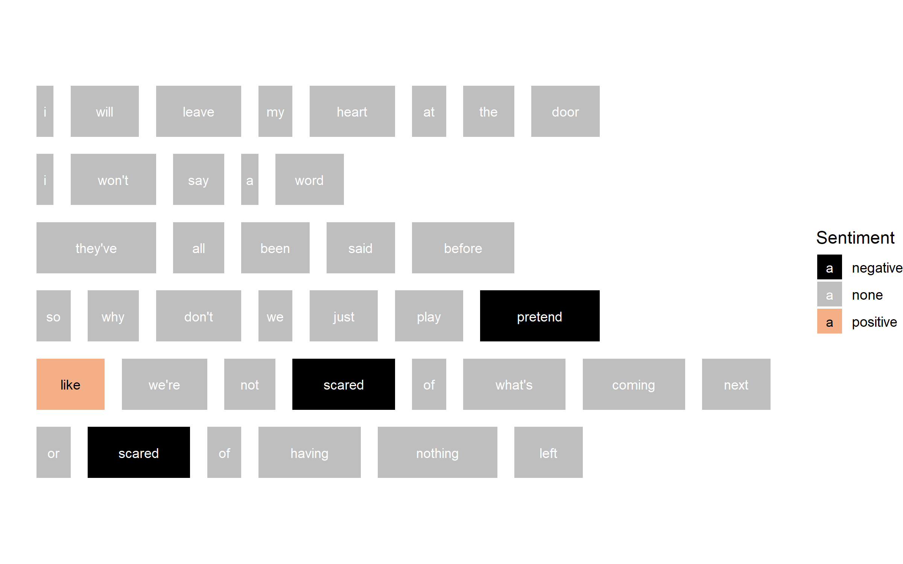
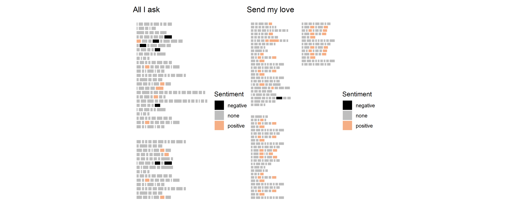

```{r setup, include=FALSE}
library(learnr)
library(tidyverse)
library(lubridate)
library(stringr)
library(glue)
library(knitr)
library(magick)
library(rvest)
library(ggpage)
library(tidytext)
library(ggalt)

knitr::opts_chunk$set(echo = FALSE, 
                      message = FALSE, 
                      warning = FALSE)
tutorial_options(exercise.timelimit = 90)

# helpful functions
getSongLyricsSentiment <- function(artist_url, num_songs = 2){
  if(is.null(artist_url)) stop("You have to provide a URL for the artist page on songlyrics.com")
  page <- read_html(artist_url)
  
  links <- page %>%
    html_nodes("table.tracklist") %>% html_nodes("tr") %>% 
    html_nodes("a") %>% html_attr("href")
  
  tracks <- page %>%
    html_nodes("table.tracklist") %>% html_nodes("tr") %>% 
    html_nodes("a") %>% html_text()
  
  songs <- map_df(1 : min(num_songs, length(tracks)), 
                  function(i){
    Sys.sleep(1) # wait one second between scrapes
    url <- links[i]
    track_name <- tracks[i]
    page <- read_html(url)
    lyrics <- page %>%
      html_nodes("#songLyricsDiv") %>%
      html_text()
    tibble(lyrics, url, track_name)
  })
  
 songs %>%
    unnest_tokens(word, 
                  lyrics) %>%
    inner_join(get_sentiments("bing"), 
               by = "word") %>%
    count(track_name, 
          sentiment) %>%
    spread(sentiment, 
           n, 
           fill = 0) %>%
    rowwise() %>%
    mutate(score = (positive - negative)/sum(positive, negative),
           overall_sentiment = ifelse(score >= 0, 
                                      "positive", 
                                      "negative"),
           track_name = str_wrap(track_name, width = 20))  
}

text_animate <- function(text, width = 400, fps = 10){

  text_all <- text %>%
    paste(collapse = " ") %>%
    str_wrap(width = width/10)
  
  num_lines <- str_count(text_all, "\n") + 1
  
  text_letters <- text %>%
  paste(collapse = " ") %>%
  str_split("") %>%
  unlist()

  blocks <- map(1:length(text_letters), function(i){
    
  text_block <- text_letters[1 : i] %>% 
    paste(collapse = "") %>%
    str_wrap(width = width/10)
  
  image_blank(width = width, 
              height = width/15 * num_lines) %>%
      image_annotate(text = as.character(text_block), 
                     size = width/20,
                     location = "+ 5") %>%
    image_background(color = "#d3d3d3")
 
  })
  
  blocks %>% 
    image_join() %>%
    image_animate(fps = fps)
}

#helpful objects
url <- "http://www.songlyrics.com/amber-adele/all-i-ask-lyrics/"
page <- read_html(url)
lyrics <- page %>%
  html_nodes("#songLyricsDiv") %>%
  html_text()
song <- tibble(text = lyrics) %>%
  separate_rows(text, 
                sep = "\n")
data <- song %>%
  ggpage_build() %>%
  select(word, line, page)
```

```{css}
@import url('https://fonts.googleapis.com/css?family=Inconsolata|Londrina+Solid&display=swap');

h1, h2, h3{
  font-family: 'Londrina Solid', cursive;
}

h3 {
  color: #f5af86;
}

h4 {
  font-family: 'Inconsolata', monospace;
  font-weight: bold;
}

.btn-primary {
  background-color: #f5af86;
}

.btn-primary:hover, .btn-primary:focus {
  background-color: #f5af86;
  opacity: 0.8;
}

.myButtonSelected {
  background-color:#666666;
}

.myButtonSelected:hover, .myButtonSelected:focus{
  background-color:#666666;
}

body, .btn{
  font-family: 'Inconsolata', monospace;
  font-size: 12pt;
}

a {
  color: #000000;
  font-weight: bold;
  background-color: #F0F0F0;
}

a:hover, a:focus {
  color: #000000;
  opacity: 0.8;
}

blockquote {
  font-size: 12pt;
  background-color: #f5af86;
  padding: 10px;
  color: #000000;
}

.highlight {
  background-color: #F0F0F0;
}

td {
  padding: 10px;
}

tr {
  border: solid #ddd 1px;
}

.center-align{ text-align:center;}

img {width: 100%}
```

```{js echo=FALSE}
$(function() {
var editor;
$('.ace_editor').each(function( index ) {
  editor = ace.edit(this);
  editor.getSession().setUseWrapMode(true);
  editor.setFontSize("16px");
  });
  
  $(".topic").click(function(){
    if($(this).text() == "Return to home page"){
    window.location.href = "https://stats100.docker.stat.auckland.ac.nz/";
    }
  })

})
```


## Lab 5

### Web scraping and text analysis

In this lab, you will learn how to scrape data from a website and some of the ways you can analysis text, using the <a href="https://www.theta.co.nz/news-blogs/tech-blog/what-is-r/" target="blank">programming language R</a>.

> The recommended start date for this lab is **Week 9**, as you'll use statistical and computational ideas covered in Topic 3.

### Sounds like..?

> Play each of the tracks below from Adele, and consider which one sounds sadder?

<iframe src="https://open.spotify.com/embed/track/6HbI4e2Y2f6HYVV6r04M4W" width="300" height="380" frameborder="0" allowtransparency="true" allow="encrypted-media"></iframe>

<iframe src="https://open.spotify.com/embed/track/4aebBr4JAihzJQR0CiIZJv" width="300" height="380" frameborder="0" allowtransparency="true" allow="encrypted-media"></iframe>

### Words as data?

We've already explored in the course how we can analysis music as data by using the Spotify API to find out things like the key of the music, and measures like energy, tempo, etc.). 

> For this lab we'll focus on the lyrics of songs. In particular, what can we learn about these two songs by analysing the words used in their lyrics?

Some of the things we can learn from text analysis include:

 + How long are the chapters? paragraphs? sentences? words?
 + What are the most common words? How repetitive are the words?
 + What sentiments do the words express e.g. happy, sad?
 
We'll also explore a few ways that we can visualise the results of our text analysis!

```{r echo=FALSE}
url <- "http://www.songlyrics.com/amber-adele/all-i-ask-lyrics/"

page <- read_html(url)

page %>%
  html_nodes("#songLyricsDiv") %>%
  html_text() %>%
  str_sub(1, 200) %>%
  text_animate()
```

### Getting sentimental

Below are some lyrics from *All I ask* (the first song you played above). 

Click on any of the words that you think express a **negative** sentiment (or feeling).

#### {#adele-find}

```{js echo=FALSE}
// get code from word find
var first_verse = "I will leave my heart at the door\nI won't say a word\nThey've all been said before\nSo why don't we just play pretend\nLike we're not scared of what's coming next\nOr scared of having nothing left"

var text_lines = first_verse.split("\n");
var text = [];
for(var i = 0; i < text_lines.length; i++)
{
   var html = "";
   var text_words = text_lines[i].split(" ");
   for(var j = 0; j < text_words.length; j++)
   {
      html = html + "<a class='btn btn-primary btn-md myButton' role='button'>" + text_words[j] + "</a> &nbsp;";
   }
   text.push(html);
}
 
var new_html = text.join("<br />");     
document.getElementById("section-adele-find").innerHTML = new_html;

$(".myButton").click(function() {
	if($(this).hasClass("list-group-item-danger")){
	//do nothing
	}
	else
	{
		$(this).addClass("myButtonSelected");
	}
})
```

### Human vs computer

Below is what the computer thinks of the same lyrics, using the `bing` *lexicon* via the R package `{tidytext}`.

```{r ggpage-demo}

```

> Cool visualisation right? The plot is courtesy of another package called `{ggpage}`. What we want is an overall measure/score of the sentiment of a song's lyrics, using the number of words that are identified as either **positive** or **negative**. We'll come back to sentiment analysis later in the lab.

### Where can we get song lyrics?

There are lots of places on the web that provide the lyrics for songs. What we are looking for is a web page that is OK with us scraping their lyrics -  <a href="http://www.songlyrics.com/" target="_blank">songlyrics.com</a> is such a website!

Head to <a href="http://www.songlyrics.com/" target="_blank">songlyrics.com</a> now and search for the lyrics for songs from an artist you like.
 
> Then watch the short video below where I describe the beginning of the process of web scraping the lyrics from `songlyrics.com` into R.


### So what about this code then?

Thinking about what I just described in the video above, slowly read through the code below and then run it.

```{r get-lyrics, exercise=TRUE}
url <- "http://www.songlyrics.com/amber-adele/all-i-ask-lyrics/"

page <- read_html(url)

lyrics <- page %>%
  html_nodes("#songLyricsDiv") %>%
  html_text()

lyrics
```

> Don't worry about the `\n` - text codes like these are what can be used to tell the webpage where to start a new line!

### Your first web scrape!

> Change the code below to scrape the lyrics of a song you want to analyse from `songlyrics.com`.

```{r scrape-DIY, exercise=TRUE}
url <- "http://www.songlyrics.com/amber-adele/all-i-ask-lyrics/"

page <- read_html(url)

lyrics <- page %>%
  html_nodes("#songLyricsDiv") %>%
  html_text()

lyrics
```

### Let's get textual!

At the beginning of the lab, I presented some questions we might want to answer about text, and in this case, song lyrics!

 + How long are the chapters? paragraphs? sentences? words?
 + What are the most common words? How repetitive are the words?

> To answer these questions, we need to take the song lyrics and create new data structures (data tables) out of them.

Since we're analysing song lyrics, we'll focus on:

 + each verse in the lyrics (we'll call this a page)
 + each line on each page
 + each word on each line

So, we want to turn all of the raw text we scraped from the web page into a `dataframe` that has each word on its own row and tells us for each word in the song what page and line it was on.

> Run the code below to see one way we can do this!

```{r page-build, exercise=TRUE, exercise.lines=23}
url <- "http://www.songlyrics.com/amber-adele/all-i-ask-lyrics/"

page <- read_html(url)

lyrics <- page %>%
  html_nodes("#songLyricsDiv") %>%
  html_text()

# this paragraph of code takes the lyrics
# and uses the \n to find out where each line is
song <- tibble(text = lyrics) %>%
  separate_rows(text, 
                sep = "\n")

# this paragraph of code builds a dataframe for us
# each word is on its own row
data <- song %>%
  ggpage_build() %>%
  select(word, line, page) %>%
  arrange(page, line)

data
```

### So many ways to count!!!!

A lot of the statistics we do is based on counting things! Now we have the lyrics data in a structure that makes sense, we can do all kinds of counting to learn more about the lyrics used.

> First, let's see how long the words are. Just to reduce how much code is shown below, I'm re-using the `data` object we created just above!

 + To add a new variable to `data` we can use the function `mutate()`. We called the new variable `word_length`.
 + To count how many letters were in each `word`, I used the function `str_count()`.
 + I gave this new `dataframe` the name `word_lengths`.
 
I've also added comments to explain the last two lines of code.

> Run the code below to see what happens!

```{r word-length, exercise=TRUE}
word_lengths <- data %>%
  mutate(word_length = str_count(word))

# this line let's you see the data
word_lengths

# this line calculates the mean word length
word_lengths %>%
  pull(word_length) %>%
  mean()
```

In the code above, `pull()` is used to obtain all the `word_length` values and then the `mean()` function is used to calculate the mean.

### How long are the lines?

To calculate how long the lines are, we need to group the data by page and line, and then use the code to count how many words are in each page/line combination.

> Run the code below, and see if you can notice the differences between this code, and the code used above.

```{r line-length, exercise=TRUE}
line_lengths <- data %>%
  count(page, line)

# this line let's you see the data
line_lengths

# this line calculates the mean line length
line_lengths$n %>% mean()
```

In the last line of the code above `line_lengths$n` is used to refer to all the values in the variable/column called `n`, where `n` is the number of words counted per line. 

### Just hit repeat!

There are `r nrow(data)` words used in these lyrics. How many times are the same words repeated? What are the most popular words used?

> We can answer these questions pretty quickly using the code below!

```{r word-sim, exercise=TRUE}
different_words <- data %>%
  count(word, sort = TRUE)

# show the data table
different_words

# count how many rows in the data table
nrow(different_words)
```

### And a 1, 2, 3, 4 ... {.tabset}

Using the same song you used before, or another song, let's do some counting!

> Change the URL to the song lyrics you want to use. Then see if you can remember how to use the `glue()` function from Lab 3 to create information sentences describing the song you are analysing! 

#### Give it a go

```{r count-DIY, exercise=TRUE, exercise.lines = 40}
url <- "http://www.songlyrics.com/amber-adele/all-i-ask-lyrics/"

page <- read_html(url)

lyrics <- page %>%
  html_nodes("#songLyricsDiv") %>%
  html_text()

song <- tibble(text = lyrics) %>%
  separate_rows(text, 
                sep = "\n")

data <- song %>%
  ggpage_build() %>%
  select(word, line, page)

mean_word_length <- data %>%
  mutate(word_length = str_count(word)) %>%
  pull(word_length) %>%
  mean() %>%
  round(digits = 2)

num_words <- nrow(data)

num_different_words <- data %>%
  count(word, sort = TRUE) %>%
  nrow()

most_popular_words <- data %>%
  count(word, sort = TRUE) %>%
  slice(1:5) %>%
  pull(word) %>%
  str_flatten(collapse = ", ")

glue("The mean length of words in this song was {mean_word_length}")
```

#### An example answer

```{r count-DIY-ans, echo=TRUE}
url <- "http://www.songlyrics.com/adele/send-my-love-to-your-new-lover-lyrics/"

page <- read_html(url)

lyrics <- page %>%
  html_nodes("#songLyricsDiv") %>%
  html_text()

song <- tibble(text = lyrics) %>%
  separate_rows(text, 
                sep = "\n")

data <- song %>%
  ggpage_build() %>%
  select(word, line, page)

mean_word_length <- data %>%
  mutate(word_length = str_count(word)) %>%
  pull(word_length) %>%
  mean() %>%
  round(digits = 2)

num_words <- nrow(data)

num_different_words <- data %>%
  count(word, sort = TRUE) %>%
  nrow()

most_popular_words <- data %>%
  count(word, sort = TRUE) %>%
  slice(1:5) %>%
  pull(word) %>%
  str_flatten(collapse = ", ")

glue("The mean length of words in this song was {mean_word_length}. There were {num_words} words used but only {num_different_words} different words. The most popular words were: {most_popular_words}.")
```

### But how the lyrics make you feel?

How could we develop a new variable that measures sentiment?

We could use this process:

1. Count up how many words were identified as positive.
2. Count up how many words were identified as negative.
3. Find the difference using positive minus negative i.e. difference = positive - negative. If the difference is positive, this means there were more positive words than negative words. If the difference is negative, this means there were more negative words than positive words.
4. Divide by difference by the total number of words identified as positive or negative, to get a `sentiment_score`. This gives us a score that is a proportion, which means, like percentages, we can use this measure to compare sentiment across different songs.

> This is not necessarily a good way to measure sentiment. We are not considering how many words in the lyrics are not in the `bing` lexicon (dictionary), and so don't get counted in our analysis. That's why we should always visualise any data we are analysing, including text!

### Visualise first ...

Below, I've shown lyrics from *All I ask* with *Send my love* below. Using the `{ggpage}` package, I've shown each word from the song lyrics as a rectangle, and colour coded the word/rectangle based on the word's sentiment.

> Which song do you think will have a higher `sentiment_score`? Is that the song you remember sounding "happier"?

```{r sent-demo}

```

### ... then calculate

For the song "All I ask", the `sentiment_score` calculated was 0.18.

FOr the song "Send my love", the `sentiment_score` calculated was 0.96.

> Do these numeric measures seem to match what you can see in the visualisation above?

### Comparing lyrics between songs

It's more fun to do sentiment analysis by comparing different songs, so the first thing we'll do is change our code so we can scrape more than one web page of lyrics. 

For the rest of the lab, you will use a function I have developed called `getSongLyricsSentiment()` to help us calculate and compare the `sentiment_score` for different songs from songlyrics.com.

We can use code to get the lyrics for each song listed, calculate the `sentiment_score` based on the lyrics, and then display the results using a cool new visualisation: a lollipop plot!

> The code below uses a webpage from songlyrics.com that lists different songs by adele: <a href="http://www.songlyrics.com/adele-lyrics/" target="blank">http://www.songlyrics.com/adele-lyrics/</a>. This is a different page than what we've been using, which was a webpage that only showed the lyrics for one song.

The code will take a little while to load, because we are **responsibly** web scraping and waiting for one second between each scrape of a song.

```{r sent-comp, exercise=TRUE, exercise.lines=20}
artist_url <- "http://www.songlyrics.com/adele-lyrics/"
num_songs <- 5

sentiment_data <- getSongLyricsSentiment(artist_url, num_songs)

sentiment_colours <- c("negative" = "#800080", 
                       "none" = "#666666", 
                       "positive" = "#7CFC00")

ggplot(data = sentiment_data) +
  geom_lollipop(aes(x = reorder(track_name, score), 
                    y = score, 
                    colour = overall_sentiment),
                size = 2) +
  coord_flip() +
  scale_colour_manual(values = sentiment_colours,
                      name = "Sentiment") +
  labs(x = "Track name",
       y = "Sentiment score")  +
  theme(panel.background = element_rect(fill = "#ffffff"))
```

### Want to see some more cool visualisations?

Check out these very cool song-lyric-related projects: 

  - <a href='https://pudding.cool/2017/05/song-repetition/' target='blank'>https://pudding.cool/2017/05/song-repetition</a>
  - <a href='https://pudding.cool/projects/vocabulary/index.html' target='blank'>https://pudding.cool/projects/vocabulary</a>

> Of course, you could apply text analysis to any source of text, for example customer reviews, open responses to surveys, emails sent to and from customers, transcripts of interviews with research participants, comments made on webpages (e.g. Facebook posts or newspaper articles) etc.

### Lab challenge!

Your challenge is to create a visualisation that compares the sentiment of at least 10 songs from an artist of your choice.

 + Change the `artist_url` to a suitable URL from songlyrics.com
 + Change the number of songs used
 + Use your own color scheme for your visualisation
 + Make sure you create an **informative plot**: Add a title, subtitle, source of the data, and helpful axis labels (Check lab 1)

There's just a little bit of code provided to get you started for this lab challenge - I've removed some! <mark>Scroll back up the page to see examples of the other code you need to add and how to make the changes!</mark>

> You will need to take screenshots of **the code you used** and the **visualisation produced**, and include these in your submission for this lab.

```{r lab5challenge, exercise = TRUE, exercise.lines = 30}
artist_url <- "http://www.songlyrics.com/adele-lyrics/"
num_songs <- 5

sentiment_data <- getSongLyricsSentiment(artist_url, num_songs)

ggplot(data = sentiment_data) +
  geom_lollipop(aes(x = reorder(track_name, score), 
                    y = score, 
                    colour = overall_sentiment),
                size = 2) +
  coord_flip()
```

## Return to home page
